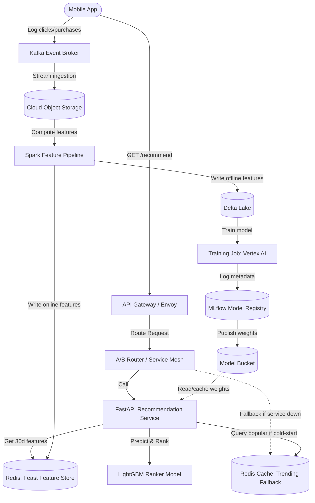

# MLOps System Design: Personalized Retail Recommendation Service

This repository contains the complete MLOps design dossier for Scenario X: Personalized In-App Recommendations for B2C Retail.

## Executive Summary

Our system, `retail-recs-service`, serves personalized, real-time product recommendations on every home-screen load for a mobile B2C retail application. The system retrieves a user's 30-day browsing and purchase behavior from a low-latency, Redis-backed Feature Store (Feast) and uses a lightweight LightGBM ranking model to score and order recommended items. Designed to handle a peak load of 800 Requests Per Second (RPS) within a strict p95 latency budget of 120 ms end-to-end, it integrates automated quality gates, a containerized multi-stage FastAPI runtime, automated CD deployments, and Prometheus/Alertmanager metrics monitoring to ensure high reliability. In case of cold-starts or system errors, the API Gateway instantly falls back to serving regional trending products cached in Redis.

## Key Numbers

| Metric / Config Parameter | Value / Detail | Justification |
|---|---|---|
| **Target RPS** | 800 RPS (Peak) / 300 RPS (Average) | Designed based on peak app traffic |
| **p95 Latency Budget** | 120 ms end-to-end | Max delay allowed before user experience degrades |
| **SLO Latency Target** | 95.0% of requests <= 120 ms | Measured over a rolling 30-day window |
| **SLO Availability Target** | 99.9% successful responses (non-5xx) | High uptime goal for home-screen components |
| **Model Size** | ~150 MB (LightGBM Ranker) | Tree-based model, lightweight and fast on CPU |
| **Inference Hardware** | 12x AWS `c6i.xlarge` (serving instances) | Fits 4 Uvicorn workers at 60% peak CPU utilization |
| **Feature Store Hardware** | 2x AWS `cache.m6g.large` (Redis cluster) | 1 Primary + 1 Replica node for high-speed lookups |
| **Total Estimated Cost** | ~$1,705 / month | Full compute, cache, and load balancing |

## System Architecture Diagram

## Navigation Links

Below are the links to each artifact in the system design dossier:

### 1. Architecture & Design Decisions
* **System Architecture Diagram & Flow**: [architecture.md](architecture/architecture.md) ([absolute link](file:///c:/Users/TEXNO/PycharmProjects/Ironhack/assessments/m7-07-assessment/architecture/architecture.md))
* **Design Pattern Justifications**: [JUSTIFICATION.md](architecture/JUSTIFICATION.md) ([absolute link](file:///c:/Users/TEXNO/PycharmProjects/Ironhack/assessments/m7-07-assessment/architecture/JUSTIFICATION.md))
* **ADR 0001 (Redis-backed Feature Store)**: [0001-redis-online-feature-store.md](architecture/adr/0001-redis-online-feature-store.md) ([absolute link](file:///c:/Users/TEXNO/PycharmProjects/Ironhack/assessments/m7-07-assessment/architecture/adr/0001-redis-online-feature-store.md))
* **ADR 0002 (Decoupled Model Weights)**: [0002-decoupling-model-weights-from-container.md](architecture/adr/0002-decoupling-model-weights-from-container.md) ([absolute link](file:///c:/Users/TEXNO/PycharmProjects/Ironhack/assessments/m7-07-assessment/architecture/adr/0002-decoupling-model-weights-from-container.md))

### 2. Model Lifecycle & Registry
* **End-to-End Model Lifecycle & Gates**: [lifecycle.md](lifecycle/lifecycle.md) ([absolute link](file:///c:/Users/TEXNO/PycharmProjects/Ironhack/assessments/m7-07-assessment/lifecycle/lifecycle.md))
* **Model Registry Schema Spec**: [model-registry.yaml](lifecycle/model-registry.yaml) ([absolute link](file:///c:/Users/TEXNO/PycharmProjects/Ironhack/assessments/m7-07-assessment/lifecycle/model-registry.yaml))

### 3. Container Packaging
* **Multi-Stage Service Dockerfile**: [Dockerfile](container/Dockerfile) ([absolute link](file:///c:/Users/TEXNO/PycharmProjects/Ironhack/assessments/m7-07-assessment/container/Dockerfile))
* **Containerization Strategy & Size Estimates**: [README.md](container/README.md) ([absolute link](file:///c:/Users/TEXNO/PycharmProjects/Ironhack/assessments/m7-07-assessment/container/README.md))

### 4. API Contract & Examples
* **OpenAPI 3.1 Contract**: [openapi.yaml](api/openapi.yaml) ([absolute link](file:///c:/Users/TEXNO/PycharmProjects/Ironhack/assessments/m7-07-assessment/api/openapi.yaml))
* **Sample API Request Payload**: [recommend-request.json](api/examples/recommend-request.json) ([absolute link](file:///c:/Users/TEXNO/PycharmProjects/Ironhack/assessments/m7-07-assessment/api/examples/recommend-request.json))
* **Sample API Response Payload**: [recommend-response.json](api/examples/recommend-response.json) ([absolute link](file:///c:/Users/TEXNO/PycharmProjects/Ironhack/assessments/m7-07-assessment/api/examples/recommend-response.json))
* **Sample API Error Payload**: [error-response.json](api/examples/error-response.json) ([absolute link](file:///c:/Users/TEXNO/PycharmProjects/Ironhack/assessments/m7-07-assessment/api/examples/error-response.json))

### 5. Capacity, SLOs, & Performance Testing
* **Capacity & Hardware Calculations**: [capacity-plan.md](serving/capacity-plan.md) ([absolute link](file:///c:/Users/TEXNO/PycharmProjects/Ironhack/assessments/m7-07-assessment/serving/capacity-plan.md))
* **Prometheus SLO Configuration**: [slos.yaml](serving/slos.yaml) ([absolute link](file:///c:/Users/TEXNO/PycharmProjects/Ironhack/assessments/m7-07-assessment/serving/slos.yaml))
* **k6 Load Testing Configuration**: [load-test-plan.md](serving/load-test-plan.md) ([absolute link](file:///c:/Users/TEXNO/PycharmProjects/Ironhack/assessments/m7-07-assessment/serving/load-test-plan.md))

### 6. Deployment, Alerting, & Operations
* **GitHub Actions CI/CD Workflow**: [deploy-model.yml](cicd/.github/workflows/deploy-model.yml) ([absolute link](file:///c:/Users/TEXNO/PycharmProjects/Ironhack/assessments/m7-07-assessment/cicd/.github/workflows/deploy-model.yml))
* **Prometheus / Alertmanager Rules**: [alerts.yaml](monitoring/alerts.yaml) ([absolute link](file:///c:/Users/TEXNO/PycharmProjects/Ironhack/assessments/m7-07-assessment/monitoring/alerts.yaml))
* **On-Call Rollback Runbook**: [rollback.md](runbooks/rollback.md) ([absolute link](file:///c:/Users/TEXNO/PycharmProjects/Ironhack/assessments/m7-07-assessment/runbooks/rollback.md))

## Open Questions

If we were to start building this system on Monday, we would need to clarify the following with the product and engineering teams:
1. **Dynamic A/B Testing Boundaries**: How quickly does the product team want to adjust traffic allocation ratios? (Do we need to build dynamic API Gateway routing updates that do not require redeploying Kubernetes config?)
2. **Cold-Start Categorization**: If a user is completely new (no 30-day history) *and* their location or demographic data is also missing, what is the default fallback sequence? (Should we fallback to global trending items, or should the app provide a onboarding category preference selection?)
3. **Data Residency Compliance**: Are there GDPR, CCPA, or other regional regulatory requirements that prohibit storing specific user browsing logs in an in-memory Redis Feature Store in certain regions? (If yes, we may need multi-region, localized Redis clusters).
