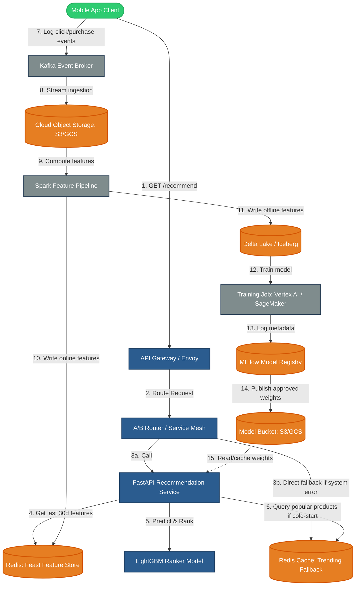

# Architecture Diagram

This document describes the high-level architecture of the `retail-recs-service` for Scenario X (Personalized B2C Retail Recommendations).

## System Architecture Diagram

Below is the Mermaid diagram showing how data flows from the user, through the API gateway, to the serving service and the database, as well as the offline training loop.

### Flow Description

1. **Client Request**: The mobile app sends a request to get recommendations for a user.
2. **API Gateway**: Handles authentication, rate limiting, and forwards the request.
3. **A/B Router**: Routes traffic based on the active A/B testing splits (e.g., 50% to `control`, 50% to `treatment-a`).
4. **Recommendation Service**:
   - Queries the **Feature Store** (Redis) using the `user_id` to get the user's last 30 days of browsing and purchase data.
   - If the user has history, the service passes features to the **LightGBM Ranker** (loaded in-memory) to get scores.
   - If the user is a cold-start (no history in Feature Store) or if the database lookup fails, the service falls back to fetching **Trending Fallback** products.
5. **Feedback Loop**: User interactions (clicks, purchases) are sent to Kafka, processed offline, and used to refresh both the feature store and the training data.
