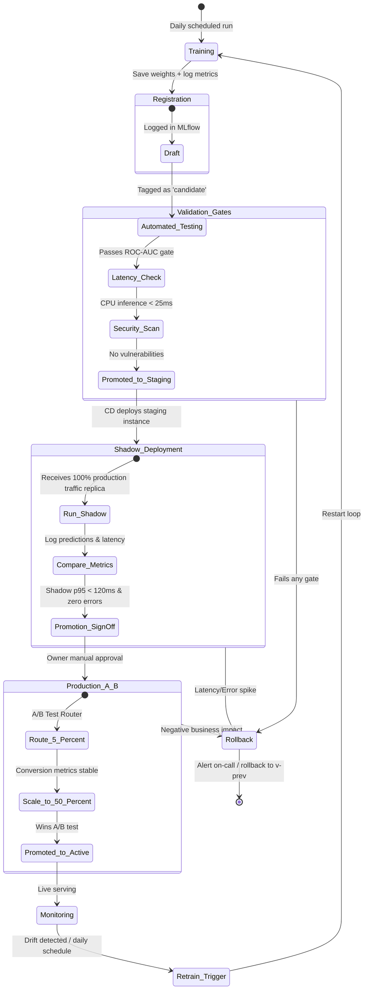

# Model Lifecycle and Registry Gates

This document defines the lifecycle process of our personalization model, outlining how we train, validate, register, deploy, and monitor models.

## End-to-End Lifecycle Process

The following diagram illustrates the lifecycle stages of a model version:

### Lifecycle Phases Details

1. **Training Phase**: The training job runs on a schedule (daily) using the latest 30-day user behavior features from the Lakehouse. It produces a new LightGBM ranker.
2. **Registration Phase**: The model is saved in our Model Registry (MLflow) with complete lineage linking it back to the training code Git commit and the dataset version.
3. **Validation Gates (Automated)**:
   - **Performance Gate**: Checks if the model's offline evaluation metric (e.g., ROC-AUC or MRR) is better than the baseline.
   - **Latency Gate**: Measures prediction latency in a test container environment (must be under 25ms under simulated load).
   - **Security Gate**: Performs dependency checks on the container packaging environment.
4. **Shadow Deployment**: The new candidate model is deployed in production but does *not* return recommendations to real users. Instead, the router duplicates incoming traffic, sends it to the shadow container, logs its performance/latency, and discards the output.
5. **Promotion Sign-Off**: The model owner reviews the shadow metrics. If the model proves stable, they sign off to begin A/B testing.
6. **Production A/B serving**: Traffic is gradually routed to the new model (e.g., starting at 5% and scaling to 50%). If business metrics (such as click-through rate) remain stable or improve, it becomes the new default model.
